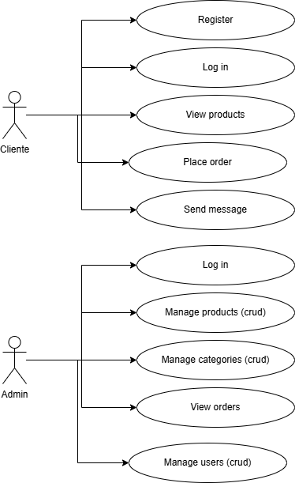
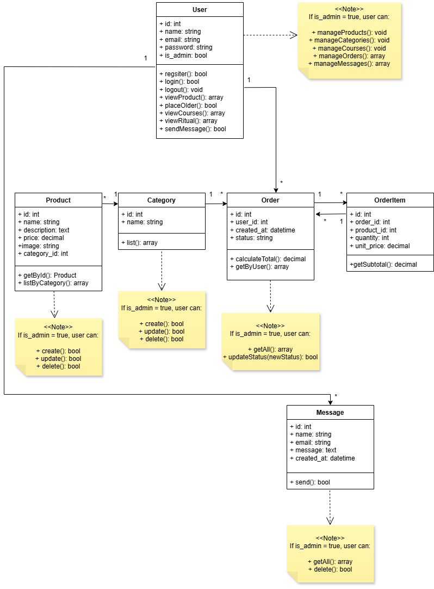

# Velitas y Momentos

**Velitas y Momentos** is an artisanal virtual shop for selling personalized candles, candle bouquets and esoteric candles. 
Developed as a final project for the fullstack web development course, it features a complete MVC system with PHP, MySQL, Bootstrap and PhpSpreadsheet.

## ✨ Main Features

- 🎨 Public product catalog with images and categories.
- 🛒 Shopping cart for registered users.
- 👤 Registration and login with customer and admin roles.
- 🔐 Role-based access control (admin / client / visitor).
- 📝 Admin CRUD for products and categories.
- 📈 Order export to Excel (PhpSpreadsheet).
- 💌 Contact form with email sending (PHPMailer).
- 🧙‍♀️ Esoteric and personalized candles for all events.
- 📱 Responsive design with Bootstrap.

---

## 🏗️ Technologies Used

- **Frontend:** HTML5, CSS3 (Bootstrap 5), JavaScript, SweetAlert2
- **Backend:** PHP 8 with pure MVC pattern
- **Database:** MySQL
- **External dependencies:**
  - PHPMailer for email sending
  - PhpSpreadsheet for Excel export
- **Local server:** Laragon

---

## 🗂️ Project Structure

```
velitasymomentos/
│
├── config/           # Database connection
├── controllers/      # PHP controllers for each entity
├── core/             # General services (e.g. EmailService)
├── models/           # PHP models for DB queries
├── public/           # Entry point with index.php
├── views/            # Views with HTML + Bootstrap
│   ├── partials/     # Reusable header and footer
│   └── ...           # auth/, admin/, products/, etc.
└── vendor/           # Libraries installed via Composer
```

---

## 📝 Use Case Diagram

This is the use case diagram for the **Velitas y Momentos** project, showing the main interactions with the system.




---
## 📝 UML Class Diagram

This is the UML class diagram for the **Velitas y Momentos** project, illustrating the classes with their attributes and methods.




---

## 🚀 Local Installation

1. Clone this repository
   ```bash
   git clone https://github.com/your-user/velitasymomentos.git
   ```
2. Copy the project to your Laragon directory (e.g. `C:\laragon\www\velitasymomentos`).

3. Create the MySQL database:
   ```sql
   CREATE DATABASE velitasymomentos CHARACTER SET utf8mb4 COLLATE utf8mb4_general_ci;
   ```

4. Import the tables with the script `velitasymomentos.sql` (includes users, products, orders, etc).

5. Configure `config/database.php` with your local credentials:
   ```php
   return new PDO('mysql:host=localhost;dbname=velitasymomentos;charset=utf8mb4', 'root', '');
   ```

6. Install Composer dependencies (PHPMailer, PhpSpreadsheet)
   ```bash
   composer install
   ```

7. Open your browser at:
   ```
   http://localhost/velitasymomentos/public
   ```

---

## 🔐 Default Access

| Role       | User                  | Password  |
|------------|-----------------------|-----------|
| Admin      | admin@velitas.com     | admin123  |
| Client     | cliente@velitas.com   | cliente123|

---

## ⚙️ Admin Features

- Dashboard with user list
- Full CRUD for products, users and categories
- View and export orders to Excel

---

## ⚙️ Client Features

- Registration and login
- Shopping cart
- View own orders
- Password recovery via email

---

## 📨 Contact

Contact form sends emails to official Velitas y Momentos inbox using PHPMailer.

---

## 📦 Export Orders to Excel

From the admin panel, export all orders in a `.xlsx` file using PhpSpreadsheet.

---

## 👩‍💻 Author & Credits

Project developed by **Diana Alfonso** as the final project for her fullstack web development course, integrating PHP, MySQL, Bootstrap, PHPMailer, and PhpSpreadsheet.

---

## ✅ Project Status

✅ **100% functional and delivered.**  
Future plans:
- Implement online payment API.
- Advanced analytics dashboard.
- Order customization with personal messages.

---

## 📜 License

This project is for educational and personal use under your preferred terms.

---